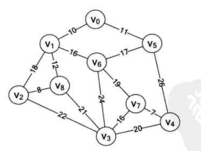

# 图算法

>图相关算法实现

## 内容列表

- [用法](#用法)
- [版本更新日志](#版本更新日志)
- [待办事项](#待办事项)
- [主要维护人员](#主要维护人员)
- [致谢](#致谢)
- [参与贡献方式](#参与贡献方式)
- [许可证](#许可证)

## 用法

### 先决条件

本仓库要求具备以下准备知识

* `c++`
* 数据结构

### 实现

* 图数据结构的测试：[graph](https://github.com/zjZSTU/GraphLib/tree/master/cplusplus/samples/graph)
* 基于图的图像分割：[graphsegmentation](https://github.com/zjZSTU/GraphLib/tree/master/cplusplus/samples/graphsegmentation)

## 版本更新日志

请参阅仓库中的[CHANGELOG](./CHANGELOG.md)

# 待办事项

* 最短路径算法实现
* 拓扑排序算法实现

## 主要维护人员

* zhujian - *Initial work* - [zjZSTU](https://github.com/zjZSTU)

## 致谢

参考以下资源

* 《大话数据结构》
* [OpenCV](https://opencv.org/)

## 参与贡献方式

欢迎任何人的参与！打开[issue](https://github.com/zjZSTU/graph_algorithm/issues)或提交合并请求

注意:

* `git`提交请遵守[Conventional Commits](https://www.conventionalcommits.org/en/v1.0.0-beta.4/)
* 如果进行版本化，请遵守[Semantic Versioning 2.0.0](https://semver.org)规范
* 如果修改README，请遵守[standard-readme](https://github.com/RichardLitt/standard-readme)规范

## 许可证

[Apache License 2.0](LICENSE) © 2019 zjZSTU